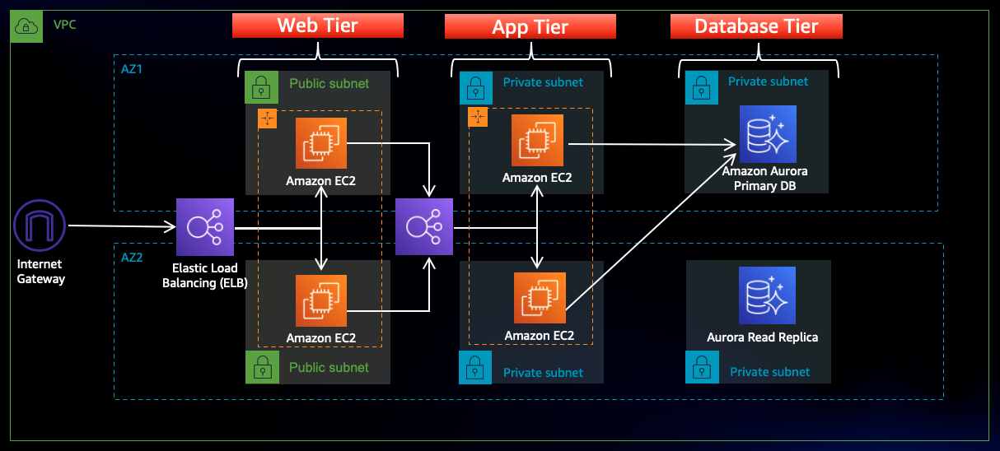

# AWS 3 Tier Web Architecture

## Description: 
This project is a hands-on walk through of a 3-tier web architecture in AWS. We will be manually creating the necessary network, security, app, and database components and configurations in order to run this architecture in an available and scalable manner.
 

## Architecture Overview

In this architecture, a public-facing Application Load Balancer forwards client traffic to our web tier EC2 instances. The web tier is running Nginx webservers that are configured to serve a React.js website and redirects our API calls to the application tier’s internal facing load balancer. The internal facing load balancer then forwards that traffic to the application tier, which is written in Node.js. The application tier manipulates data in an Aurora MySQL multi-AZ database and returns it to our web tier. Load balancing, health checks and autoscaling groups are created at each layer to maintain the availability of this architecture.

